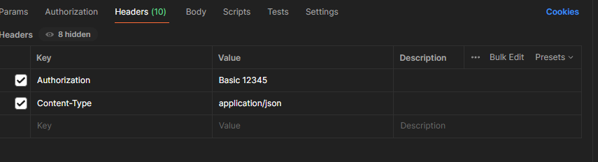

<h2>API-RANKING CS</h2>

Api que tem o objetivo de extrair o arquivo md dos ranking da valve de cs listando  
Standing | Points | Team | Name | Roster

[Link do Repositorio Valve](https://github.com/ValveSoftware/counter-strike_regional_standings)

**RODAR LOCALMENTE**

Ter o docker instalado.

Rodar docker-compose up -d para subir mongodb.

**Scheduler:
Rodando como cron,atualmente configurado para rodar ao estartar.

**Rotas:
http://localhost:8080/api/ranking/valve => Rota Rest

Será implementado futuramente token Bearer.

Tecnologias: 
JAVA 17 
MongoDb
Docker
